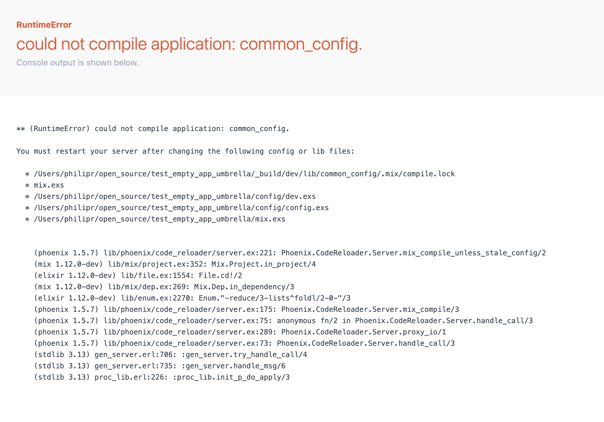

# TestEmptyApp.Umbrella

A test phoenix project that demonstrates a bug in phoenix hot reloading due to a manifest file not existing when an app has no source files.

## Setup
```sh
mix setup
```

## To Run
To test, run `mix phx.server`

Observe the error at `localhost:4000` or in the console with elixir 1.12.0-dev

